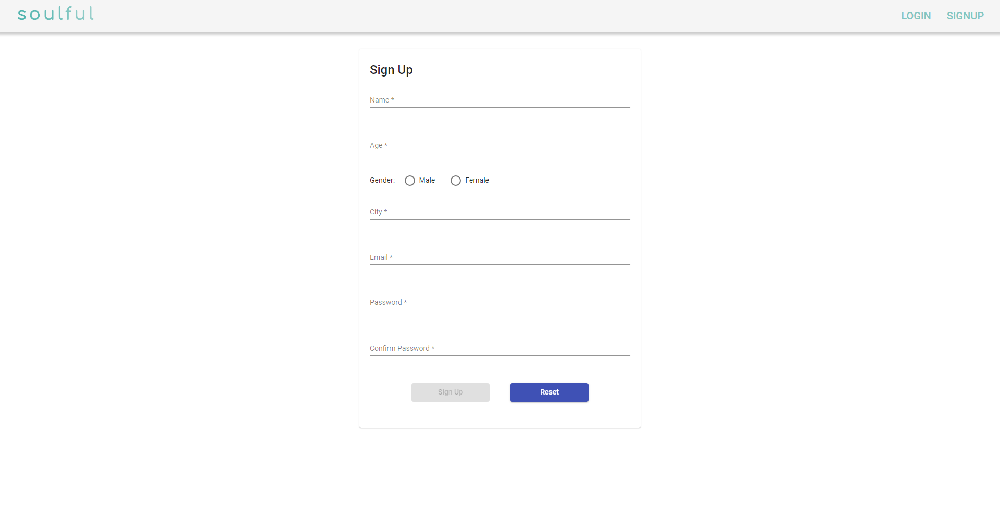

# Soulful
## Summary 
This is a tinder like application that allow user to find there soulmates and match with them. This application is a full-stack application created using Angular and Spring Boot.

## Sources
- Frontend - `angular`, `typescript`, `html`, `css`
- Backend - `spring boot`, `mongodb`, `neo4j`, `mysql`
- Mircroservice - `docker`
- API - `restful api`

# Preview

## Login

## Signup

## Home

## Profile 

## Development server frontend 

Run `ng serve` for a dev server. Navigate to `http://localhost:4200/`. The application will automatically reload if you change any of the source files.

## Development server backend 
Run `mvn package`, `docker-compose up --build` to run the backend application. The application will run on the provided ports in the [docker-compose](./server/docker-compose.yml) file. 

## Build

Run `ng build` to build the project. The build artifacts will be stored in the `dist/` directory.
